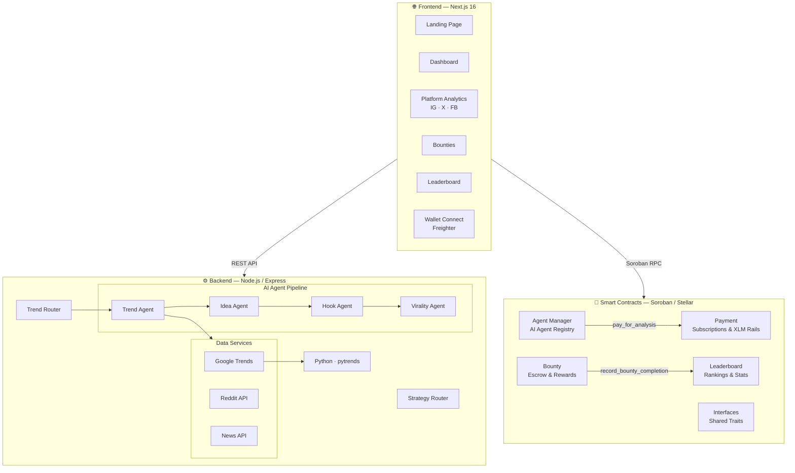

<p align="center">
  
  
  
  
  
</p>

<h1 align="center">🤖 Agentro</h1>

<p align="center">
  <strong>AI Content Strategy Engine on the Stellar Blockchain</strong>
</p>

<p align="center">
  Agentro combines on-chain AI agent management with real-time trend intelligence<br/>
  to deliver data-driven content strategies for creators and brands.
</p>

<p align="center">
  <a href="#-features">Features</a> ·
  <a href="#%EF%B8%8F-architecture">Architecture</a> ·
  <a href="#-tech-stack">Tech Stack</a> ·
  <a href="#-getting-started">Getting Started</a> ·
  <a href="#-smart-contracts">Smart Contracts</a> ·
  <a href="#-api-reference">API Reference</a> ·
  <a href="#-contributing">Contributing</a>
</p>

<p align="center">
  👉 <strong><a href="https://YOUR_DEMO_LINK_HERE.com">Live Demo URL</a></strong> | 📺 <strong><a href="https://drive.google.com/file/d/1UGWWNTsouYoJUhDBC3l6F2UBqGjw7gTK/view?usp=drive_link">Watch Demo Video</a></strong>
</p>

<br/>

## 📱 Previews

### Desktop & Mobile Views
<p align="center">
  <!-- Mobile Preview Screenshot -->
  
</p>
<p align="center">
  <!-- Mobile Preview Screenshot -->
  
</p>
<p align="center">
  <!-- Mobile Preview Screenshot -->
  
</p>
<p align="center">
  <!-- Mobile Preview Screenshot -->
  
</p>
<p align="center">
  <!-- Mobile Preview Screenshot -->
  
</p>
---

## ✨ Features

| Feature | Description |
|---|---|
| 🧠 **AI Agent Pipeline** | Multi-agent system ─ Trend Analyst → Idea Generator → Hook Writer → Virality Scorer ─ powered by Groq LLMs |
| 📊 **Real-Time Trend Intelligence** | Aggregated signals from Google Trends, Reddit, and News APIs with deduplication |
| 💰 **On-Chain Payments** | Subscription and pay-per-analysis model using native XLM via Soroban smart contracts |
| 🏆 **Bounty System** | Create, fund, and complete bounties with XLM escrow — winners are paid on-chain and tracked on the leaderboard |
| 📈 **Leaderboard** | Canonical on-chain rankings by total earnings and bounties completed |
| 🔐 **Wallet-First Auth** | No email/password — connect your Stellar wallet (Freighter) and sign transactions directly |
| 🌐 **Platform Analytics** | Dedicated dashboards for Instagram, X (Twitter), and Facebook content performance |
| 🎨 **Themeable UI** | Dark/light mode toggle with aurora-gradient glassmorphism design |

---

## 🏗️ Architecture



---

## 🛠 Tech Stack

<table>
  <tr>
    <th>Layer</th>
    <th>Technology</th>
    <th>Purpose</th>
  </tr>
  <tr>
    <td><strong>Contracts</strong></td>
    <td>Rust · Soroban SDK 25.3 · Stellar Testnet</td>
    <td>On-chain logic for payments, agents, bounties, leaderboard</td>
  </tr>
  <tr>
    <td><strong>Backend</strong></td>
    <td>Node.js 20 · Express 5 · Groq SDK · Python 3.11</td>
    <td>AI agent pipeline, trend aggregation, REST API</td>
  </tr>
  <tr>
    <td><strong>Frontend</strong></td>
    <td>Next.js 16 · React 19 · TypeScript · Tailwind CSS 4</td>
    <td>SSR dashboard, wallet integration, analytics UI</td>
  </tr>
  <tr>
    <td><strong>Wallet</strong></td>
    <td>Stellar Wallets Kit · Freighter API · Stellar SDK</td>
    <td>Wallet-based auth and transaction signing</td>
  </tr>
  <tr>
    <td><strong>UI</strong></td>
    <td>Framer Motion · Recharts · Lucide Icons</td>
    <td>Animations, charts, iconography</td>
  </tr>
  <tr>
    <td><strong>CI/CD</strong></td>
    <td>GitHub Actions</td>
    <td>Automated build, test, lint, security scan, deploy</td>
  </tr>
</table>

---

## 📁 Project Structure

```
Agentro/
├── contracts/                   # Soroban smart contracts (Rust)
│   ├── interfaces/              # Shared traits & types
│   ├── agent-manager/           # AI agent registry & usage billing
│   ├── agent-token/             # Legacy token contract (reference)
│   ├── payment/                 # Subscriptions & XLM payment rails
│   ├── bounty/                  # Escrow, funding, & reward distribution
│   ├── leaderboard/             # On-chain rankings & stats
│   ├── docs/                    # Architecture & deployment docs
│   └── scripts/                 # Deployment scripts (PowerShell)
│
├── backend/                     # Node.js API server
│   ├── agents/                  # AI agents (trend, idea, hook, virality)
│   ├── services/                # Data services (Google Trends, Reddit, News)
│   ├── routes/                  # Express route handlers
│   ├── config/                  # Environment config
│   ├── python/                  # Python Google Trends scraper
│   └── server.js                # Entry point
│
├── frontend/                    # Next.js 16 web application
│   ├── app/                     # App Router pages
│   │   ├── dashboard/           # Main dashboard
│   │   ├── trends/              # Real-time trends
│   │   ├── bounties/            # Bounty marketplace
│   │   ├── leaderboard/         # Global rankings
│   │   ├── instagram/           # IG analytics
│   │   ├── x/                   # X (Twitter) analytics
│   │   └── facebook/            # Facebook analytics
│   ├── components/              # Reusable UI components
│   ├── context/                 # React context (Wallet)
│   ├── hooks/                   # Custom React hooks
│   ├── services/                # API client services
│   └── lib/                     # Utility functions
│
└── .github/workflows/           # CI/CD pipelines
    ├── ci.yml                   # Build, test, lint, security
    └── deploy.yml               # Manual deployment workflow
```

---

## 🚀 Getting Started

### Prerequisites

| Tool | Version | Install |
|---|---|---|
| **Rust** | stable | [rustup.rs](https://rustup.rs) |
| **Node.js** | ≥ 20 | [nodejs.org](https://nodejs.org) |
| **Python** | ≥ 3.11 | [python.org](https://python.org) |
| **Stellar CLI** | latest | `cargo install --locked stellar-cli` |

### 1. Clone the Repository

```bash
git clone https://github.com/YOUR_USERNAME/Agentro.git
cd Agentro
```

### 2. Smart Contracts

```bash
cd contracts

# Run all contract tests
cargo test --workspace

# Build optimized WASM binaries
stellar contract build

# Deploy to testnet (see contracts/scripts/deploy-testnet.ps1)
```

### 3. Backend

```bash
cd backend

# Install Node dependencies
npm install

# Install Python dependencies
pip install -r requirements.txt

# Create environment file
cp .env.example .env
# Edit .env with your API keys (see Environment Variables below)

# Start dev server
npm start
```

### 4. Frontend

```bash
cd frontend

# Install dependencies
npm install

# Create environment file
cp .env.example .env.local
# Edit .env.local with your contract IDs (see Environment Variables below)

# Start dev server
npm run dev
```

Visit **http://localhost:3000** — the app will connect to the backend at `http://localhost:5000`.

---

## 🔑 Environment Variables

### Backend (`backend/.env`)

| Variable | Description | Required |
|---|---|---|
| `NEWS_API_KEY` | [NewsAPI.org](https://newsapi.org) API key | ✅ |
| `REDDIT_CLIENT_ID` | Reddit app client ID | ✅ |
| `REDDIT_SECRET` | Reddit app secret | ✅ |
| `GROQ_API_KEY` | [Groq](https://console.groq.com) API key for LLM agents | ✅ |
| `PORT` | Server port (default: `5000`) | ❌ |
| `NODE_ENV` | Environment (default: `development`) | ❌ |

### Frontend (`frontend/.env.local`)

| Variable | Description |
|---|---|
| `NEXT_PUBLIC_API_URL` | Backend API URL (e.g. `http://localhost:5000`) |
| `NEXT_PUBLIC_STELLAR_NETWORK` | `testnet` or `mainnet` |
| `NEXT_PUBLIC_STELLAR_RPC_URL` | Soroban RPC endpoint |
| `NEXT_PUBLIC_STELLAR_NETWORK_PASSPHRASE` | Network passphrase |
| `NEXT_PUBLIC_STELLAR_READ_ADDRESS` | Public address for read-only queries |
| `NEXT_PUBLIC_XLM_ASSET_CONTRACT_ID` | Native XLM SAC contract ID |
| `NEXT_PUBLIC_AGT_TOKEN_CONTRACT_ID` | Agent token contract ID |
| `NEXT_PUBLIC_PAYMENT_CONTRACT_ID` | Payment contract ID |
| `NEXT_PUBLIC_LEADERBOARD_CONTRACT_ID` | Leaderboard contract ID |
| `NEXT_PUBLIC_BOUNTY_CONTRACT_ID` | Bounty contract ID |
| `NEXT_PUBLIC_AGENT_MANAGER_CONTRACT_ID` | Agent Manager contract ID |

---

## 🦀 Smart Contracts

All contracts are deployed on **Stellar Soroban Testnet**.

### Contract Addresses & Details

| Contract | Address | Tx Hash | Token / Pool Address | Description |
|---|---|---|---|---|
| **Payment** | `CCAOSNZNVNZP...VD7VQ` | `[Update TxHash]` | `[Token Address]` | Subscription management & XLM payment rails |
| **Agent Manager** | `CBYZ4EGIIWXY...J54VS` | `[Update TxHash]` | N/A | AI agent creation, registry & usage billing |
| **Bounty** | `CALEZTBUJFWH...RVLK2` | `[Update TxHash]` | `[Token Address]` | Escrow-based bounty lifecycle management |
| **Leaderboard** | `CAGTBHWT2OU4...DI4V` | `[Update TxHash]` | N/A | On-chain rankings & earnings tracking |

### Contract Events

| Event | Topic Keys | Data |
|---|---|---|
| `agt_crtd` | `(owner)` | `(agent_id, created_at)` |
| `agt_used` | `(owner, user)` | `(agent_id, amount, timestamp)` |
| `payment` | `(user, treasury)` | `(amount, expires_at)` |
| `bnty_crt` | `(creator)` | `(bounty_id, reward)` |
| `bnt_fund` | `(creator)` | `(bounty_id, reward)` |
| `bnt_done` | `(creator, winner)` | `(bounty_id, reward)` |
| `lb_update` | `(user)` | `(reward, total_earnings, bounties_completed)` |

### Auth Model

- **Wallet address** is the user identity — no email/password flows
- User-owned state changes require `require_auth()`
- Payment and bounty custody rely on token allowances (`transfer_from`)
- Contract-held balances are released via `transfer`

---

## 📡 API Reference

### Trends

| Method | Endpoint | Description |
|---|---|---|
| `GET` | `/api/trends` | Fetch aggregated trends from Google, Reddit, News |
| `GET` | `/api/trends?q=<query>` | Search trends by keyword |

### Strategy

| Method | Endpoint | Description |
|---|---|---|
| `POST` | `/api/strategy` | Generate AI content strategy from trend data |

### Health

| Method | Endpoint | Description |
|---|---|---|
| `GET` | `/health` | Server health check |

---

## ⚡ CI/CD

The project uses **GitHub Actions** for automated CI/CD:

### CI Pipeline (`ci.yml`)

Runs on every push to `main` and on all pull requests:

| Job | What it does |
|---|---|
| 🦀 **Contracts** | `cargo fmt` → `cargo clippy` → `cargo test` → `cargo build --release` |
| ⚙️ **Backend** | `npm ci` → Python deps install → Server start verification |
| 🌐 **Frontend** | `npm ci` → ESLint → `npm run build` (with env vars) |
| 🔒 **Security** | TruffleHog secret scan → `npm audit` on both packages |

### Deploy Pipeline (`deploy.yml`)

Manual trigger via `workflow_dispatch` with environment selection (staging/production):

- Runs full CI first
- Deploys contracts, backend, and frontend in parallel
- Customizable deploy steps for your hosting provider

---

## 🤝 Contributing

Contributions are welcome! Here's how to get started:

1. **Fork** the repository
2. **Create** a feature branch: `git checkout -b feat/amazing-feature`
3. **Commit** your changes: `git commit -m "feat: add amazing feature"`
4. **Push** to the branch: `git push origin feat/amazing-feature`
5. **Open** a Pull Request

### Commit Convention

Use [Conventional Commits](https://www.conventionalcommits.org/):

- `feat:` — new feature
- `fix:` — bug fix
- `docs:` — documentation only
- `refactor:` — code restructuring
- `test:` — adding or updating tests
- `chore:` — maintenance tasks

---

## 📄 License

This project is licensed under the **MIT License** — see the [LICENSE](LICENSE) file for details.

---

<p align="center">
  <sub>Built with ❤️ on <a href="https://stellar.org">Stellar</a></sub>
</p>
